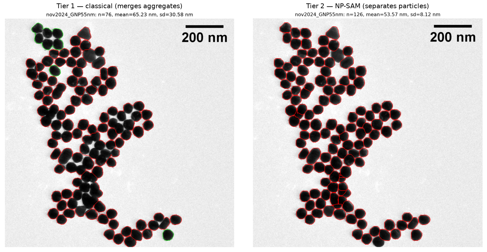
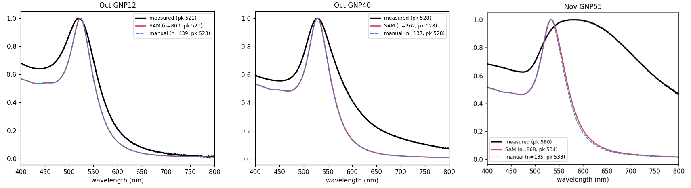
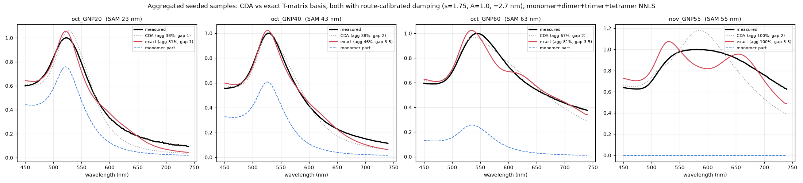

# AuNP Speciation — UV-Vis broadening from monomer/dimer/trimer equilibria

> **Part of _Speciate_ — Built with Claude: Life Sciences (Builder Track).**
> An automated pipeline that turns a TEM micrograph of gold nanoparticles into
> mean size, size distribution, and **aggregation state**, then predicts the
> UV-Vis spectrum with **zero fitted parameters** — replacing a half-day of manual
> counting. This repo is the **optics + inversion** half; stage-one automated TEM
> sizing lives in
> **[tem-particle-metrics](https://github.com/e-stella/tem-particle-metrics)**.
>
> 📄 **[Read the mid-project progress report (PDF)](reports/progress_260713.pdf)** —
> full writeup: motivation, validation, and findings.

### 1 · Foundation-model segmentation handles aggregates

*Classical thresholding merges touching particles into oversized blobs (left); an
NP-SAM / Segment-Anything model separates them correctly (right). Automated sizes
match hand-counting to within **±6%** across all eight samples, from up to 6× more
particles.*

### 2 · Zero-parameter UV-Vis prediction from TEM size alone

*Predicted (red) vs measured (black), normalized to peak. Well-dispersed samples
match within a few nm with **nothing fitted**; where the prediction breaks (right,
55 nm), that 46 nm gap **is** the aggregation signal.*

### 3 · Aggregation, quantified

*Exact multipole T-matrix fit (red) vs fast CDA (dotted): the aggregated gold
fraction per sample — 0% for the pure control, ~⅓ to ⅘ for the aggregated
batches. Only the total fraction is identifiable, so size comes from TEM.*

---

Prototype model for the hypothesis (Dragnea group, Indiana University) that the
anomalously broad, red-tailed UV-Vis of 12 nm gold colloids is caused by
reversible cluster formation (monomer ⇌ dimer ⇌ trimer …), not size
polydispersity alone.

See `CLAUDE.md` for the scientific background, architecture, and — importantly —
the known limitations. `MODELLING_STACK.md` documents each modelling choice and
its alternatives: production optics use tabulated Johnson & Christy gold with an
exact multi-sphere T-matrix backend for clusters (the fast coupled-dipole model
under-couples at near-contact and serves only as a lower bound).

## Install
```bash
pip install -r requirements.txt              # system env: CDA/Mie/fits
# exact T-matrix backend needs a pinned venv:
python -m venv mstm-env
mstm-env/bin/pip install "numpy==1.26.4" "scipy==1.11.4" treams matplotlib
```

## Run
```bash
python scripts/verify.py   # physics sanity checks
python scripts/demo.py     # writes figures to outputs/
```

## What the demo shows
- `fig1_species_spectra.png` — per-particle extinction of monomer / dimer /
  linear & triangular trimer (coupling adds red-side intensity).
- `fig2_broadening.png` — monomer-only (4% polydispersity) vs a realistic
  speciation mixture; the peak barely moves but a **red tail** appears
  (quantified by a red-tail index, not FWHM).
- `fig3_isosbestic.png` — temperature series (van 't Hoff equilibrium) showing
  an **isosbestic point**, the thermodynamic fingerprint of the two-species mix.
- `fig4_gap_sensitivity.png` — interparticle gap is the dominant lever on the
  red tail.
- `fig5_inverse_fit.png` — Layer 3 single-spectrum fit: recovers the aggregated
  gold fraction; flags size/polydispersity/split as under-determined.
- `fig6_mstm_vs_cda.png` — exact T-matrix vs point-dipole CDA: CDA under-couples
  (exact gives 1.6×/2.8× more red-tail for dimer/trimer). Needs the mstm-env venv.
- `fig7_global_fit.png` — global multi-temperature fit: recovers size,
  thermodynamics (ΔH, ΔS) and the aggregated-fraction-vs-T curve jointly.
- `fig8_fit_real.png` — real-data driver: loads a UV-Vis CSV and fits it with the
  cached EXACT optics. On the self-consistent example it recovers D=12.0 nm,
  ΔH₂=-25.4 kJ/mol, and the aggregated-vs-T curve to the third decimal.

## Package layout
```
src/aunp_speciation/
  dielectric.py   gold ε(λ)  [analytic — swap for J&C]
  mie.py          single-sphere Mie + dipole polarizability
  clusters.py         coupled-dipole (CDA) clusters — fast, lower-bound coupling
  clusters_tmatrix.py exact multipole T-matrix backend (treams; mstm-env venv)
  equilibrium.py      monomer/dimer/trimer association vs temperature
  spectra.py          polydispersity + mixing; backend='cda'|'tmatrix'
  fitting.py          Layer 3 single-spectrum inverse fit
  fit_global.py       Layer 3 global multi-temperature fit
  basis_cache.py      precomputed exact-optics basis + interpolator
  io_data.py          load experimental UV-Vis CSV/TSV (single or T-series)
scripts/
  verify.py           regression / physics checks
  demo.py             figs 1-4
  fit_demo.py         single-spectrum fit self-test (fig5)
  validate_mstm.py    exact-vs-CDA validation (fig6; mstm-env/bin/python)
  fit_global_demo.py  global multi-temperature fit self-test (fig7)
  build_tmatrix_basis.py  precompute exact basis cache (mstm-env/bin/python)
  make_example_data.py    write data/example_series.csv
  fit_real.py             load & fit a real UV-Vis file (fig8)
data/
  example_series.csv  synthetic example temperature series for fit_real.py
```

## Status
Layers 1-3 implemented, plus an exact T-matrix optics backend and a global
multi-temperature fit. Single-spectrum fit gives the aggregated fraction; the
global T-fit adds size + thermodynamics (ΔH, ΔS) + speciation-vs-T. Remaining:
wire tabulated ε + size-damping into the size-integral, precompute a T-matrix
basis for quantitative fits, add the Haiss ratio, and run on real data. See
`CLAUDE.md`.
